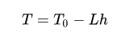
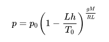
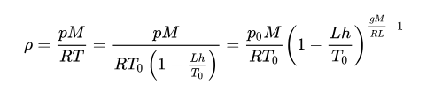
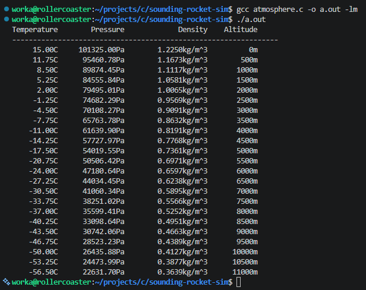

# Goal of project:
You give the program a rocket.
To define a rocket in my program, you need to provide its: dry mass, propellant mass, thrust, engine efficiency, body diameter, drag coefficient.
The program outputs how the flight goes: velocity, altitude, and acceleration at every second, where the engine cuts out, and how high it ultimately gets.

# atmosphere.c:
The goal is to figure out the air density at every step of the flight from 0m to 11000m. Every step is 500m for now. 0m to 11000m is the troposphere.
- density is: d = m/V, where d is density, m is mass, V is volume
- increasing pressure = increases density
- increasing temperature generally decreases the density 
- air density, like air pressure, decreases with increasing altitude. 
    - this is because density decreases as temperature increases (gets hotter)
    - it also changes with variations in atmospheric pressure, temperature, and humidity.
- constants:\
- 
- temperature in Kelvin at altitude h (meters) above sea level is calculated using:\

- pressure at altitude h is calculated using:\

    - The unit of measurement used for pressure will be Pa.
    - The exponential units and the units used in the parenthesis end up cancelling out - which leave a plain number reaching p0 which is in Pascals (Pa)
- density is then calculated according to a molar form of the ideal gas law using:\
    
    - density will be kg/m^3. I got this by substituting in the units and cancelling out until I got to kg/m^3.
    - the units inside parenthesis and exponent are unitless once cancelled out
    - I used the following conversions for the rest of the substitution:
        - Pa = kg/(m*s^2), J = kg * m^2 / s^2
- results:\

## Resources used:
https://en.wikipedia.org/wiki/International_Standard_Atmosphere
- ISA is a static atmospheric model of how pressure, temperature, density and viscosity of the Earth's atmosphere change over a wide range of altitudes or elevations.
https://en.wikipedia.org/wiki/Density_of_air
